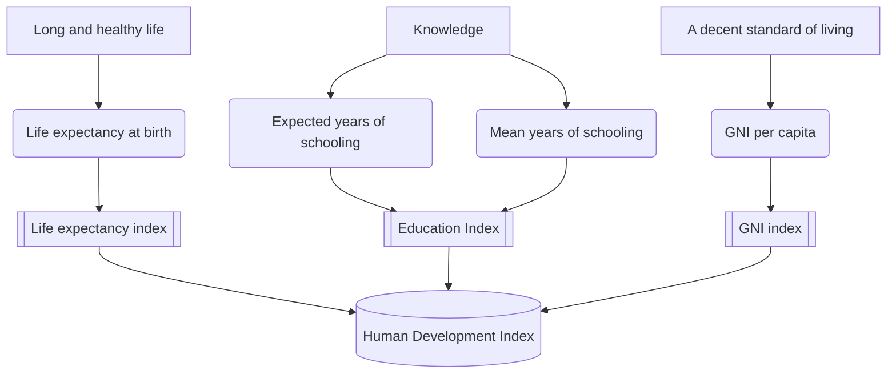

# UNDP Brand YML
Name Surname
2025-08-16

# Section

Vestibulum ultrices, tortor at mattis porta, odio nisi rutrum nulla, sit
amet tincidunt eros quam facilisis tellus. Fusce eleifend lectus in
elementum lacinia. Nam auctor nunc in massa ullamcorper, sit amet auctor
ante accumsan. Nam ut varius metus. Curabitur eget tristique leo. Cras
finibus euismod erat eget elementum. Integer vel placerat ex. Ut id eros
quis lectus lacinia venenatis hendrerit vel ante.

## Subsection A

Vestibulum ultrices, tortor at mattis porta, odio nisi rutrum nulla, sit
amet tincidunt eros quam facilisis tellus. Fusce eleifend lectus in
elementum lacinia. Nam auctor nunc in massa ullamcorper, sit amet auctor
ante accumsan. Nam ut varius metus. Curabitur eget tristique leo. Cras
finibus euismod erat eget elementum. Integer vel placerat ex. Ut id eros
quis lectus lacinia venenatis hendrerit vel ante.

Etiam quis tortor luctus, pellentesque ante a, finibus dolor. Phasellus
in nibh et magna pulvinar malesuada. Ut nisl ex, sagittis at
sollicitudin et, sollicitudin id nunc. In id porta urna. Proin porta
dolor dolor, vel dapibus nisi lacinia in. Pellentesque ante mauris,
ornare non euismod a, fermentum ut sapien. Proin sed vehicula enim.
Aliquam tortor odio, vestibulum vitae odio in, tempor molestie justo.
Praesent maximus lacus nec leo maximus blandit.

## Subsection B

Ut ut condimentum augue, nec eleifend nisl. Sed facilisis egestas odio
ac pretium. Pellentesque consequat magna sed venenatis sagittis. Vivamus
feugiat lobortis magna vitae accumsan. Pellentesque euismod malesuada
hendrerit. Ut non mauris non arcu condimentum sodales vitae vitae dolor.
Nullam dapibus, velit eget lacinia rutrum, ipsum justo malesuada odio,
et lobortis sapien magna vel lacus. Nulla purus neque, hendrerit non
malesuada eget, mattis vel erat. Suspendisse potenti.

| Country | Life expectancy at birth (years) | Expected years of schooling (years) | Mean years of schooling (years) | GNI per capita (2021 PPP \$) | HDI |
|:---|:--:|:--:|:--:|:--:|:--:|
| Iceland | 82,7 | 18,9 | 13,9 | 69 117 | 0,972 |
| Norway | 83,3 | 18,8 | 13,1 | 112 710 | 0,970 |
| Switzerland | 84,0 | 16,7 | 13,9 | 81 949 | 0,970 |
| Denmark | 81,9 | 18,7 | 13,0 | 76 008 | 0,962 |
| Germany | 81,4 | 17,3 | 14,3 | 64 053 | 0,959 |
| Sweden | 83,3 | 19,0 | 12,7 | 66 102 | 0,959 |
| Australia | 83,9 | 20,7 | 12,9 | 58 277 | 0,958 |
| Hong Kong, China (SAR) | 85,5 | 16,9 | 12,4 | 69 436 | 0,955 |
| Netherlands | 82,2 | 18,6 | 12,7 | 68 344 | 0,955 |
| Belgium | 82,1 | 19,0 | 12,7 | 63 582 | 0,951 |

Table 1: Top 10 Countries by 2025 Human Development Index (HDI) and its
Components[^1]

As seen in <a href="#tbl-hdi" class="quarto-xref">Table 1</a>. Nunc ac
dignissim magna. Vestibulum vitae egestas elit. Proin feugiat leo quis
ante condimentum, eu ornare mauris feugiat. Pellentesque habitant morbi
tristique senectus et netus et malesuada fames ac turpis egestas. Mauris
cursus laoreet ex, dignissim bibendum est posuere iaculis. Suspendisse
et maximus elit. In fringilla gravida ornare. Aenean id lectus pulvinar,
sagittis felis nec, rutrum risus. Nam vel neque eu arcu blandit
fringilla et in quam. Aliquam luctus est sit amet vestibulum eleifend.
Phasellus elementum sagittis molestie. Proin tempor lorem arcu, at
condimentum purus volutpat eu. Fusce et pellentesque ligula.
Pellentesque id tellus at erat luctus fringilla. Suspendisse potenti.

## Subsection C

Etiam non efficitur urna, quis elementum nisi. Mauris posuere a augue
vel gravida. Praesent luctus erat et ex iaculis interdum. Nulla
vestibulum quam ac nunc consequat vulputate. Nullam iaculis lobortis sem
sit amet fringilla. Aliquam semper, metus ut blandit semper, nulla velit
fermentum sapien, fermentum ultrices dolor sapien sed leo. Vestibulum
molestie faucibus magna, at feugiat nulla ullamcorper a. Aliquam erat
volutpat. Praesent scelerisque magna a justo maximus, sit amet suscipit
mauris tempor. Nulla nec dolor eget ipsum pellentesque lobortis a in
ipsum. Morbi turpis turpis, fringilla a eleifend maximus, viverra nec
neque. Class aptent taciti sociosqu ad litora torquent per conubia
nostra, per inceptos himenaeos.

The components of the HDI are depicted in **?@fig-hdi** above. Etiam
quis tortor luctus, pellentesque ante a, finibus dolor. Phasellus in
nibh et magna pulvinar malesuada. Ut nisl ex, sagittis at sollicitudin
et, sollicitudin id nunc. In id porta urna. Proin porta dolor dolor, vel
dapibus nisi lacinia in. Pellentesque ante mauris, ornare non euismod a,
fermentum ut sapien. Proin sed vehicula enim. Aliquam tortor odio,
vestibulum vitae odio in, tempor molestie justo. Praesent maximus lacus
nec leo maximus blandit.

[^1]: Source: UNDP (United Nations Development Programme). 2025. Human
    Development Report 2025: A matter of choice: People and
    possibilities in the age of AI. New York Retrieved from
    [hdr.undp.org](https://hdr.undp.org/data-center/human-development-index#/indicies/HDI).
