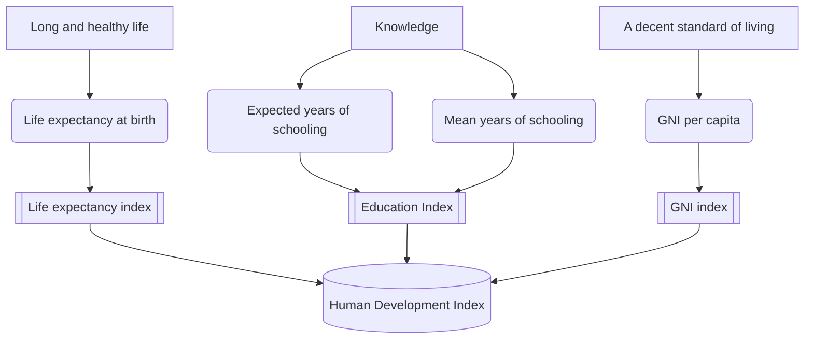

# UNDP Brand YML
Name Surname
2025-08-16

# Section

Maecenas turpis velit, ultricies non elementum vel, luctus nec nunc.
Nulla a diam interdum, faucibus sapien viverra, finibus metus. Donec non
tortor diam. In ut elit aliquet, bibendum sem et, aliquam tortor. Donec
congue, sem at rhoncus ultrices, nunc augue cursus erat, quis porttitor
mauris libero ut ex. Nullam quis leo urna. Donec faucibus ligula eget
pellentesque interdum. Lorem ipsum dolor sit amet, consectetur
adipiscing elit. Aenean rhoncus interdum erat ut ultricies. Aenean
tempus ex non elit suscipit, quis dignissim enim efficitur. Proin
laoreet enim massa, vitae laoreet nulla mollis quis.

## Subsection A

Praesent ornare dolor turpis, sed tincidunt nisl pretium eget. Curabitur
sed iaculis ex, vitae tristique sapien. Quisque nec ex dolor. Quisque ut
nisl a libero egestas molestie. Nulla vel porta nulla. Phasellus id
pretium arcu. Etiam sed mi pellentesque nibh scelerisque elementum sed
at urna. Ut congue molestie nibh, sit amet pretium ligula consectetur
eu. Integer consectetur augue justo, at placerat erat posuere at. Ut
elementum urna lectus, vitae bibendum neque pulvinar quis. Suspendisse
vulputate cursus eros id maximus. Duis pulvinar facilisis massa, et
condimentum est viverra congue. Curabitur ornare convallis nisl. Morbi
dictum scelerisque turpis quis pellentesque. Etiam lectus risus, luctus
lobortis risus ut, rutrum vulputate justo. Nulla facilisi.

Nulla eget cursus ipsum. Vivamus porttitor leo diam, sed volutpat lectus
facilisis sit amet. Maecenas et pulvinar metus. Ut at dignissim tellus.
In in tincidunt elit. Etiam vulputate lobortis arcu, vel faucibus leo
lobortis ac. Aliquam erat volutpat. In interdum orci ac est euismod
euismod. Nunc eleifend tristique risus, at lacinia odio commodo in. Sed
aliquet ligula odio, sed tempor neque ultricies sit amet.

## Subsection B

Vestibulum ultrices, tortor at mattis porta, odio nisi rutrum nulla, sit
amet tincidunt eros quam facilisis tellus. Fusce eleifend lectus in
elementum lacinia. Nam auctor nunc in massa ullamcorper, sit amet auctor
ante accumsan. Nam ut varius metus. Curabitur eget tristique leo. Cras
finibus euismod erat eget elementum. Integer vel placerat ex. Ut id eros
quis lectus lacinia venenatis hendrerit vel ante.

| Country | Life expectancy at birth (years) | Expected years of schooling (years) | Mean years of schooling (years) | GNI per capita (2021 PPP \$) | HDI |
|:---|:--:|:--:|:--:|:--:|:--:|
| Iceland | 82,7 | 18,9 | 13,9 | 69 117 | 0,972 |
| Norway | 83,3 | 18,8 | 13,1 | 112 710 | 0,970 |
| Switzerland | 84,0 | 16,7 | 13,9 | 81 949 | 0,970 |
| Denmark | 81,9 | 18,7 | 13,0 | 76 008 | 0,962 |
| Germany | 81,4 | 17,3 | 14,3 | 64 053 | 0,959 |
| Sweden | 83,3 | 19,0 | 12,7 | 66 102 | 0,959 |
| Australia | 83,9 | 20,7 | 12,9 | 58 277 | 0,958 |
| Hong Kong, China (SAR) | 85,5 | 16,9 | 12,4 | 69 436 | 0,955 |
| Netherlands | 82,2 | 18,6 | 12,7 | 68 344 | 0,955 |
| Belgium | 82,1 | 19,0 | 12,7 | 63 582 | 0,951 |

Table 1: Top 10 Countries by 2025 Human Development Index (HDI) and its
Components[^1]

As seen in <a href="#tbl-hdi" class="quarto-xref">Table 1</a>. Praesent
ornare dolor turpis, sed tincidunt nisl pretium eget. Curabitur sed
iaculis ex, vitae tristique sapien. Quisque nec ex dolor. Quisque ut
nisl a libero egestas molestie. Nulla vel porta nulla. Phasellus id
pretium arcu. Etiam sed mi pellentesque nibh scelerisque elementum sed
at urna. Ut congue molestie nibh, sit amet pretium ligula consectetur
eu. Integer consectetur augue justo, at placerat erat posuere at. Ut
elementum urna lectus, vitae bibendum neque pulvinar quis. Suspendisse
vulputate cursus eros id maximus. Duis pulvinar facilisis massa, et
condimentum est viverra congue. Curabitur ornare convallis nisl. Morbi
dictum scelerisque turpis quis pellentesque. Etiam lectus risus, luctus
lobortis risus ut, rutrum vulputate justo. Nulla facilisi.

## Subsection C

Aenean placerat luctus tortor vitae molestie. Nulla at aliquet nulla.
Sed efficitur tellus orci, sed fringilla lectus laoreet eget. Vivamus
maximus quam sit amet arcu dignissim, sed accumsan massa ullamcorper.
Sed iaculis tincidunt feugiat. Nulla in est at nunc ultricies dictum ut
vitae nunc. Aenean convallis vel diam at malesuada. Suspendisse arcu
libero, vehicula tempus ultrices a, placerat sit amet tortor. Sed dictum
id nulla commodo mattis. Aliquam mollis, nunc eu tristique faucibus,
purus lacus tincidunt nulla, ac pretium lorem nunc ut enim. Curabitur
eget mattis nisl, vitae sodales augue. Nam felis massa, bibendum sit
amet nulla vel, vulputate rutrum lacus. Aenean convallis odio pharetra
nulla mattis consequat.

The components of the HDI are depicted in **?@fig-hdi** above. Maecenas
turpis velit, ultricies non elementum vel, luctus nec nunc. Nulla a diam
interdum, faucibus sapien viverra, finibus metus. Donec non tortor diam.
In ut elit aliquet, bibendum sem et, aliquam tortor. Donec congue, sem
at rhoncus ultrices, nunc augue cursus erat, quis porttitor mauris
libero ut ex. Nullam quis leo urna. Donec faucibus ligula eget
pellentesque interdum. Lorem ipsum dolor sit amet, consectetur
adipiscing elit. Aenean rhoncus interdum erat ut ultricies. Aenean
tempus ex non elit suscipit, quis dignissim enim efficitur. Proin
laoreet enim massa, vitae laoreet nulla mollis quis.

[^1]: Source: UNDP (United Nations Development Programme). 2025. Human
    Development Report 2025: A matter of choice: People and
    possibilities in the age of AI. New York Retrieved from
    [hdr.undp.org](https://hdr.undp.org/data-center/human-development-index#/indicies/HDI).
