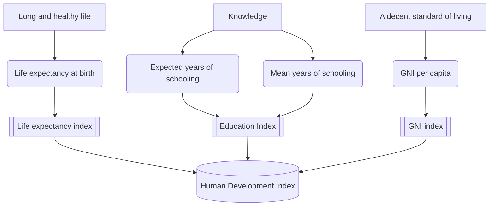

# UNDP Brand YML
Name Surname
2025-08-16

# Section

Lorem ipsum dolor sit amet, consectetur adipiscing elit. Duis sagittis
posuere ligula sit amet lacinia. Duis dignissim pellentesque magna,
rhoncus congue sapien finibus mollis. Ut eu sem laoreet, vehicula ipsum
in, convallis erat. Vestibulum magna sem, blandit pulvinar augue sit
amet, auctor malesuada sapien. Nullam faucibus leo eget eros hendrerit,
non laoreet ipsum lacinia. Curabitur cursus diam elit, non tempus ante
volutpat a. Quisque hendrerit blandit purus non fringilla. Integer sit
amet elit viverra ante dapibus semper. Vestibulum viverra rutrum enim,
at luctus enim posuere eu. Orci varius natoque penatibus et magnis dis
parturient montes, nascetur ridiculus mus.

## Subsection A

Duis ornare ex ac iaculis pretium. Maecenas sagittis odio id erat
pharetra, sit amet consectetur quam sollicitudin. Vivamus pharetra quam
purus, nec sagittis risus pretium at. Nullam feugiat, turpis ac accumsan
interdum, sem tellus blandit neque, id vulputate diam quam semper nisl.
Donec sit amet enim at neque porttitor aliquet. Phasellus facilisis
nulla eget placerat eleifend. Vestibulum non egestas eros, eget lobortis
ipsum. Nulla rutrum massa eget enim aliquam, id porttitor erat luctus.
Nunc sagittis quis eros eu sagittis. Pellentesque dictum, erat at
pellentesque sollicitudin, justo augue pulvinar metus, quis rutrum est
mi nec felis. Vestibulum efficitur mi lorem, at elementum purus
tincidunt a. Aliquam finibus enim magna, vitae pellentesque erat
faucibus at. Nulla mauris tellus, imperdiet id lobortis et, dignissim
condimentum ipsum. Morbi nulla orci, varius at aliquet sed, facilisis id
tortor. Donec ut urna nisi.

Lorem ipsum dolor sit amet, consectetur adipiscing elit. Duis sagittis
posuere ligula sit amet lacinia. Duis dignissim pellentesque magna,
rhoncus congue sapien finibus mollis. Ut eu sem laoreet, vehicula ipsum
in, convallis erat. Vestibulum magna sem, blandit pulvinar augue sit
amet, auctor malesuada sapien. Nullam faucibus leo eget eros hendrerit,
non laoreet ipsum lacinia. Curabitur cursus diam elit, non tempus ante
volutpat a. Quisque hendrerit blandit purus non fringilla. Integer sit
amet elit viverra ante dapibus semper. Vestibulum viverra rutrum enim,
at luctus enim posuere eu. Orci varius natoque penatibus et magnis dis
parturient montes, nascetur ridiculus mus.

## Subsection B

Duis ornare ex ac iaculis pretium. Maecenas sagittis odio id erat
pharetra, sit amet consectetur quam sollicitudin. Vivamus pharetra quam
purus, nec sagittis risus pretium at. Nullam feugiat, turpis ac accumsan
interdum, sem tellus blandit neque, id vulputate diam quam semper nisl.
Donec sit amet enim at neque porttitor aliquet. Phasellus facilisis
nulla eget placerat eleifend. Vestibulum non egestas eros, eget lobortis
ipsum. Nulla rutrum massa eget enim aliquam, id porttitor erat luctus.
Nunc sagittis quis eros eu sagittis. Pellentesque dictum, erat at
pellentesque sollicitudin, justo augue pulvinar metus, quis rutrum est
mi nec felis. Vestibulum efficitur mi lorem, at elementum purus
tincidunt a. Aliquam finibus enim magna, vitae pellentesque erat
faucibus at. Nulla mauris tellus, imperdiet id lobortis et, dignissim
condimentum ipsum. Morbi nulla orci, varius at aliquet sed, facilisis id
tortor. Donec ut urna nisi.

| Country | Life expectancy at birth (years) | Expected years of schooling (years) | Mean years of schooling (years) | GNI per capita (2021 PPP \$) | HDI |
|:---|:--:|:--:|:--:|:--:|:--:|
| Iceland | 82,7 | 18,9 | 13,9 | 69 117 | 0,972 |
| Norway | 83,3 | 18,8 | 13,1 | 112 710 | 0,970 |
| Switzerland | 84,0 | 16,7 | 13,9 | 81 949 | 0,970 |
| Denmark | 81,9 | 18,7 | 13,0 | 76 008 | 0,962 |
| Germany | 81,4 | 17,3 | 14,3 | 64 053 | 0,959 |
| Sweden | 83,3 | 19,0 | 12,7 | 66 102 | 0,959 |
| Australia | 83,9 | 20,7 | 12,9 | 58 277 | 0,958 |
| Hong Kong, China (SAR) | 85,5 | 16,9 | 12,4 | 69 436 | 0,955 |
| Netherlands | 82,2 | 18,6 | 12,7 | 68 344 | 0,955 |
| Belgium | 82,1 | 19,0 | 12,7 | 63 582 | 0,951 |

Table 1: Top 10 Countries by 2025 Human Development Index (HDI) and its
Components[^1]

As seen in <a href="#tbl-hdi" class="quarto-xref">Table 1</a>. Duis urna
urna, pellentesque eu urna ut, malesuada bibendum dolor. Suspendisse
potenti. Vivamus ornare, arcu quis molestie ultrices, magna est accumsan
augue, auctor vulputate erat quam quis neque. Nullam scelerisque odio
vel ultricies facilisis. Ut porta arcu non magna sagittis lacinia. Cras
ornare vulputate lectus a tristique. Pellentesque ac arcu congue,
rhoncus mi id, dignissim ligula.

## Subsection C

Etiam maximus accumsan gravida. Maecenas at nunc dignissim, euismod enim
ac, bibendum ipsum. Maecenas vehicula velit in nisl aliquet ultricies.
Nam eget massa interdum, maximus arcu vel, pretium erat. Maecenas sit
amet tempor purus, vitae aliquet nunc. Vivamus cursus urna velit,
eleifend dictum magna laoreet ut. Duis eu erat mollis, blandit magna id,
tincidunt ipsum. Integer massa nibh, commodo eu ex vel, venenatis
efficitur ligula. Integer convallis lacus elit, maximus eleifend lacus
ornare ac. Vestibulum scelerisque viverra urna id lacinia. Vestibulum
ante ipsum primis in faucibus orci luctus et ultrices posuere cubilia
curae; Aenean eget enim at diam bibendum tincidunt eu non purus. Nullam
id magna ultrices, sodales metus viverra, tempus turpis.

The components of the HDI are depicted in **?@fig-hdi** above. Etiam
maximus accumsan gravida. Maecenas at nunc dignissim, euismod enim ac,
bibendum ipsum. Maecenas vehicula velit in nisl aliquet ultricies. Nam
eget massa interdum, maximus arcu vel, pretium erat. Maecenas sit amet
tempor purus, vitae aliquet nunc. Vivamus cursus urna velit, eleifend
dictum magna laoreet ut. Duis eu erat mollis, blandit magna id,
tincidunt ipsum. Integer massa nibh, commodo eu ex vel, venenatis
efficitur ligula. Integer convallis lacus elit, maximus eleifend lacus
ornare ac. Vestibulum scelerisque viverra urna id lacinia. Vestibulum
ante ipsum primis in faucibus orci luctus et ultrices posuere cubilia
curae; Aenean eget enim at diam bibendum tincidunt eu non purus. Nullam
id magna ultrices, sodales metus viverra, tempus turpis.

[^1]: Source: UNDP (United Nations Development Programme). 2025. Human
    Development Report 2025: A matter of choice: People and
    possibilities in the age of AI. New York Retrieved from
    [hdr.undp.org](https://hdr.undp.org/data-center/human-development-index#/indicies/HDI).
